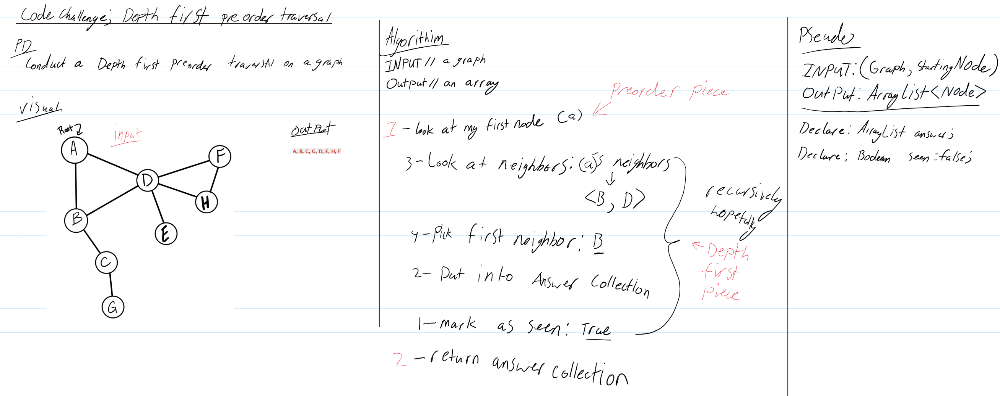

# Data Structures & Algorithms
##### By: Pablo Rosales
This repository contains challenges relating to Data-Structures & Algorithms.
The challenges were written primarily by Code Fellows and this README will serve as a table of contents to the individual challenges and their appropriate README's as well.

## Table of Contents
Format:
* Link to code - Link to docs

1. [reverseArray]() - [Challenge Documentation](#challenge-1-reversearray)
2. [arrayShift]() - [Challenge Documentation](#challenge-2-arrayshift)
3. [arrayBinarySearch]() - [Challenge Documentation](#challenge-3-arraybinarysearch)
4. [Linked Lists]() - [Challenge Documentation](#challenge-4-linked-lists)
5. [llInsertions]() - [Challenge Documentation](#challenge-5-llinsertions)
6. [llKthFromEnd]() - [Challenge Documentation](#challenge-6-llkthfromend)
7. [ll_merge]() - [Challenge Documentation](#challenge-7-ll_merge)
8. [Stacks & Queues]() - [Challenge Documentation](#challenge-8-stacks--queues)
9. [queueWithStacks]() - [Challenge Documentation](#challenge-9-queuewithstacks)
10. [fifo animalShelter]() - [Challenge Documentation](#challenge-10-fifo-animalshelter)
11. [multiBracketValidation]() - [Challenge Documentation](#challenge-11-multibracketvalidation)
12. [Trees]() - [Challenge Documentation](#challenge-12-trees)
13. [FizzBuzz]() - [Challenge Documentation](#challenge-13-fizzbuzz)
14. [breadthFirstTraversal]() - [Challenge Documentation](#challenge-14-breadthfirsttraversal)
15. [getMax (Binary tree)]() - [Challenge Documentation](#challenge-15-getmax)
16. [Graph](src/main/java/graph) - [Challenge Documentation](#challenge-16-graph)
17. [Breadth First Graph](src/main/java/graph/Graph.java) - [Challenge Documentation](#challenge-17-breadth-first-graph)
18. [Get Edge](src/main/java/graph/Graph.java) - [Challenge Documentation](#challenge-18-get-edge)
19. [Depth First Preorder Traversal]() - [Challenge Documentation](#challenge-19-depth-first-preoder-traversal)
20. [Hashtable](src/main/java/Hashtable) - [Challenge Documentation](#challenge-20-hashtable)
21. [Insertion Sort](src/main/java/InsertionSort/InsertionSort.java) - [Challenge Documentation](#challenge-21-insertion-sort)

# 401 Code Challenge Documentation

### Challenge 1: reverseArray

### Approach and Efficiency

### Solution

    

---
### Challenge 2: ArrayShift

### Approach and Efficiency

### Solution

    

---
### Challenge 3: arrayBinarySearch

### Approach and Efficiency

### Solution

    

---

### Challenge 4: Linked Lists

### Approach and Efficiency

### Solution
image placeholder

---
### Challenge 5: LLInsertions

### Approach and Efficiency

### Solution
image placeholder

---
### Challenge 6: LLKthFromEnd

### Approach and Efficiency

### Solution

    

---
### Challenge 7: LL_merge

### Approach and Efficiency

### Solution

    

---
### Challenge 8: Stacks & Queues

### Approach and Efficiency

### Solution
image placeholder

---
### Challenge 9: queueWithStacks

### Approach and Efficiency

### Solution
image placeholder

---
### Challenge 10: fifo animalShelter

### Approach and Efficiency

### Solution

    

---
### Challenge 11: multiBracketValidation

### Approach and Efficiency

### Solution
image placeholder

---
### Challenge 12: Trees

### Approach and Efficiency

### Solution
image placeholder

---
### Challenge 13: FizzBuzz

### Approach and Efficiency

### Solution
image placeholder

---
### Challenge 14: breadthFirstTraversal

### Approach and Efficiency

### Solution

    

---
### Challenge 15: getMax

### Approach and Efficiency

### Solution
image placeholder

---
### Challenge 16: Graph
Implement your own Graph. The graph should be represented as an adjacency list, and should include the following methods:
1. AddNode()
    * Adds a new node to the graph
    * Takes in the value of that node
    * Returns the added node
2. AddEdge()
    * Adds a new edge between two nodes in the graph
    * Include the ability to have a “weight”
    * Takes in the two nodes to be connected by the edge
    * Both nodes should already be in the Graph
3. GetNodes()
    * Returns all of the nodes in the graph as a collection (set, list, or similar)
4. GetNeighbors()
    * Returns a collection of nodes connected to the given node
    * Takes in a given node
    * Include the weight of the connection in the returned collection
5. Size()
    * Returns the total number of nodes in the graph

### Approach & Efficiency

### Solution
image placeholder

---
### Challenge 17: Breadth First Graph
Extend your graph object with a breadth-first traversal method that accepts a starting node. Without utilizing any of the built-in methods available to your language, return a collection of nodes in the order they were visited. Display the collection.

### Approach and Efficiency

### Solution
image placeholder

---
### Challenge 18: get edge

### Approach and Efficiency

### Solution

    

---
### Challenge 19: Depth first preoder traversal

### Approach and Efficiency

### Solution

    

---
### Challenge 20: Hashtable

* A method/function named `add` that takes in both the key and value. This method should hash the key and add the key and value pair to the table.
* A method/function named `Find` that takes in the key and returns the value from key/value pair.
* A method/function named `contains` that takes in the key and returns if the key exists in the table already.
* A method/function named `GetHash` that takes in a key and returns the index in the array the key is stored.

### Approach and Efficiency

### Solution
Lab challenge (needs a whiteboard after class)

---
### Challenge 21: Insertion sort
Sorts an array from left to right iteratively placing each new element into the appropriate index.

### Approach and Efficiency
At it’s worst, the array is in the reverse order, giving a runtime of O(n^2), but on average it isn't going to be the worst possible runtime so it will still be O(n^2) with any data set. As for space, all this is doing is sorting the same array in place so it takes the same amount of space or O(1)

---
### Challenge 22: mergeSort

### Approach and Efficiency

### Solution

    

